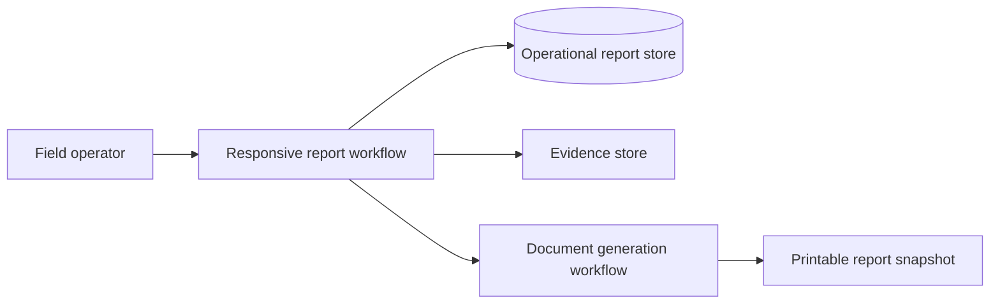
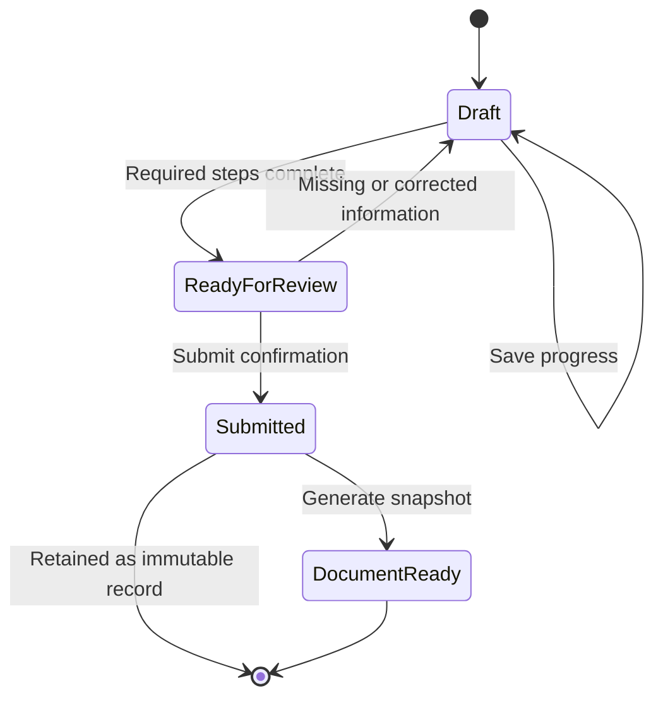

# Architecture

## Context flow

The client workflow owns form state and step validation. The operational store
persists reports and child records. The document workflow receives an approved
snapshot and returns a printable representation; it must not mutate a submitted
report.

## State model

## Design decisions

| Decision | Rationale |
|---|---|
| Draft-first workflow | A field report may be completed across multiple interactions. |
| Child records for workforce and services | Repeating business entities should not be stored as concatenated text. |
| Immutable submitted state | Preserves the audit boundary after confirmation. |
| Parent-owned validation | Each step exposes completion rules before submission. |
| Separate document generation | Keeps report persistence independent from presentation output. |
